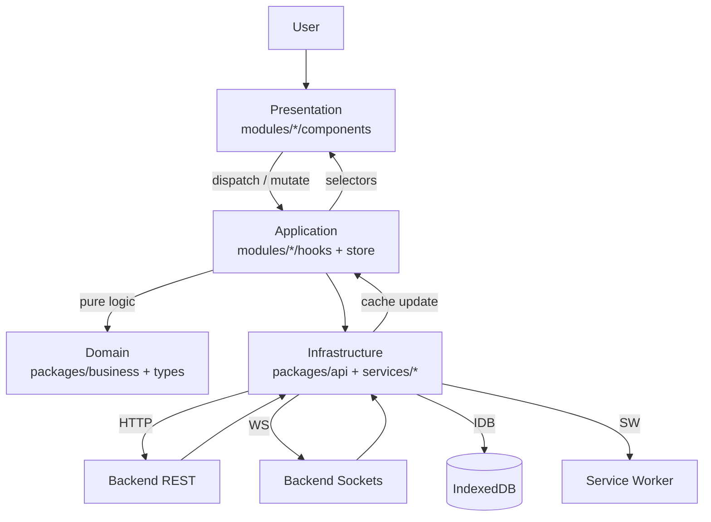
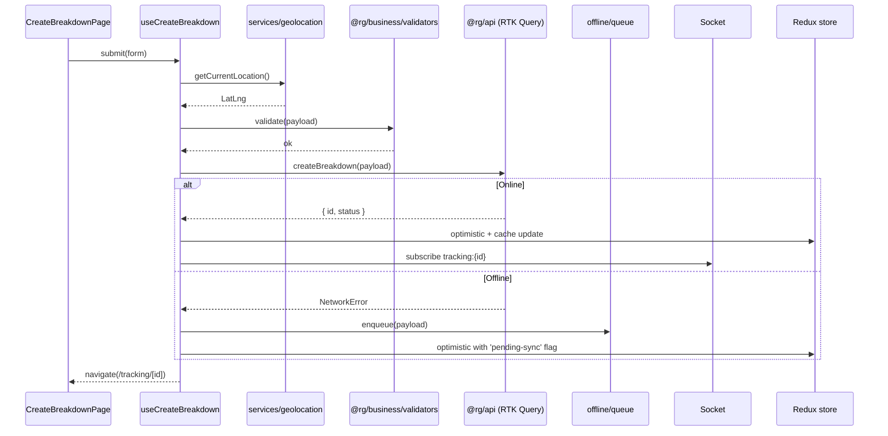
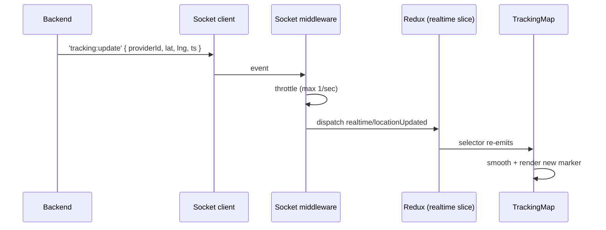

# Data Flow

```mermaid
flowchart TB
    user[User] --> UI[Presentation<br/>modules/*/components]
    UI -->|dispatch / mutate| APP[Application<br/>modules/*/hooks + store]
    APP -->|pure logic| DOMAIN[Domain<br/>packages/business + types]
    APP --> INFRA[Infrastructure<br/>packages/api + services/*]
    INFRA -->|HTTP| BE[Backend REST]
    INFRA -->|WS| WS[Backend Sockets]
    INFRA -->|IDB| IDB[(IndexedDB)]
    INFRA -->|SW| SW[Service Worker]
    BE --> INFRA
    WS --> INFRA
    INFRA -->|cache update| APP
    APP -->|selectors| UI
```

## Sequence: Creating a Breakdown Request

```mermaid
sequenceDiagram
  participant C as CreateBreakdownPage
  participant H as useCreateBreakdown
  participant G as services/geolocation
  participant V as @rg/business/validators
  participant A as @rg/api (RTK Query)
  participant Q as offline/queue
  participant S as Socket
  participant R as Redux store

  C->>H: submit(form)
  H->>G: getCurrentLocation()
  G-->>H: LatLng
  H->>V: validate(payload)
  V-->>H: ok
  H->>A: createBreakdown(payload)
  alt Online
    A-->>H: { id, status }
    H->>R: optimistic + cache update
    H->>S: subscribe tracking:{id}
  else Offline
    A-->>H: NetworkError
    H->>Q: enqueue(payload)
    H->>R: optimistic with 'pending-sync' flag
  end
  H-->>C: navigate(/tracking/[id])
```

## Sequence: Live Tracking Tick

```mermaid
sequenceDiagram
  participant Srv as Backend
  participant S as Socket client
  participant M as Socket middleware
  participant R as Redux (realtime slice)
  participant T as TrackingMap

  Srv->>S: 'tracking:update' { providerId, lat, lng, ts }
  S->>M: event
  M->>M: throttle (max 1/sec)
  M->>R: dispatch realtime/locationUpdated
  R->>T: selector re-emits
  T->>T: smooth + render new marker
```
